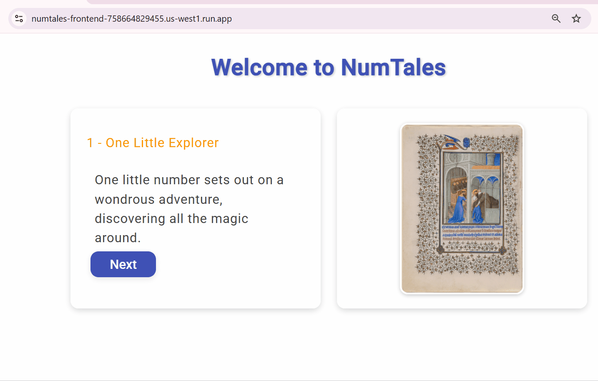

# NumTales : Combining Kindergarten Storytelling, Numbers, and Art with MongoDB Vector Search


NumTales is an engaging educational application designed to help children explore and enjoy the world of numbers through captivating stories and vibrant imagery. Developed as an entry for the MongoDB Challenge hackathon, NumTales transforms learning into an interactive adventure and demonstrates how creative data integration can spark new ways of viewing our world.

## Purpose

NumTales leverages Retrieval-Augmented Generation (RAG) to enhance storytelling with dynamic number-based concepts. By integrating MongoDB's vector search, we retrieve relevant content efficiently and refine generative outputs, making mathematical concepts more intuitive.

A core part of the system is chunking, which segments stories into meaningful parts to ensure better semantic search results. We use sentence-transformers/all-MiniLM-L6-v2 for embedding and indexing text vectors, delivering fast and precise query matches.

## Features

- **Story-Driven Learning:** Engaging narratives combine with mathematical ideas to make numbers less intimidating and more relatable.
- **Retrieval-Augmented Generation (RAG):** AI-powered retrieval refines responses dynamically, making interactions smarter and more relevant.
- **Optimized Search with Chunking:** Stories and mathematical content are split into structured segments to boost precision in vector-based queries.
- **Modern Angular Frontend:** A responsive and visually appealing interface designed for intuitive use.
- **Python Backend:** Powered by Flask and MongoDB vector search to serve relevant stories and images.
- **Interactive UI:** Thoughtful design enhances exploration and learning.
- **Semantic Text Embeddings:** Uses sentence-transformers/all-MiniLM-L6-v2 for high-quality text search.

## Running the application

To run the full stack locally using Docker Compose:

1. Ensure you have [Docker](https://www.docker.com/) and [Docker Compose](https://docs.docker.com/compose/) installed.
2. In the project root, run:

   ```bash
   docker-compose up --build
   ```

3. Once the containers are running, visit `http://localhost:4200` in your web browser to access the application.
4. To stop the application, press `CTRL+C` in the terminal where Docker Compose is running, and then run:

   ```bash
   docker-compose down
   ```

This will stop and remove the containers, networks, and volumes defined in your `docker-compose.yml` file.

## Development

For development, you can run the frontend and backend separately:

- **Frontend:** Navigate to the `front-end` directory and run `npm install` to install dependencies, then run `ng serve` to start the development server.
- **Backend:** Navigate to the `api` directory and run `pip install -r requirements.txt` to install dependencies, then run `python app.py` to start the Flask server.

Ensure that the frontend is configured to communicate with the backend by setting the correct API URL in the frontend environment files.

## Deploying with Google Cloud Build and Cloud Run

This section explains how to build container images for NumTales using Google Cloud Build and deploy them using Google Cloud Run. Make sure you have the [gcloud CLI](https://cloud.google.com/sdk/docs/install) installed, are logged in with `gcloud auth login`, and have set your current project with `gcloud config set project YOUR_PROJECT_ID`.

### Step 1: Build Your Container Images

For each component of the project, use Cloud Build to create your container images. Replace `YOUR_PROJECT_ID` with your actual Google Cloud project ID.

- **Backend:**

  Navigate to the `api` directory and run:

  ```bash
  gcloud builds submit --tag gcr.io/YOUR_PROJECT_ID/numtales-backend .
  ```

- **Frontend:**

  Navigate to the `front-end` directory and run:

  ```bash
  gcloud builds submit --tag gcr.io/YOUR_PROJECT_ID/numtales-frontend .
  ```

### Step 2: Deploy Your Containers with Cloud Run

Once your images are built, deploy them with Cloud Run. Cloud Run will automatically assign a URL for each service. Specify your region (for example, `us-central1`) and allow unauthenticated access if desired.

- **Deploy the Backend:**

  ```bash
  gcloud run deploy numtales-backend \
    --image gcr.io/YOUR_PROJECT_ID/numtales-backend \
    --platform managed \
    --region us-central1 \
    --allow-unauthenticated
  ```

- **Deploy the Frontend:**

  ```bash
  gcloud run deploy numtales-frontend \
    --image gcr.io/YOUR_PROJECT_ID/numtales-frontend \
    --platform managed \
    --region us-central1 \
    --allow-unauthenticated
  ```

After deployment, update your frontend configuration with the URL of the deployed backend if necessary. This lets your Angular application correctly interface with the Flask API.

## Contributing

We welcome contributions! Please follow these steps:

1. Fork the repository.
2. Create a new branch for your feature or bugfix.
3. Make your changes and commit them with clear messages.
4. Push your branch to your forked repository.
5. Submit a pull request detailing your changes.

Please ensure your code adheres to our coding standards and includes appropriate tests.

## License

This project is licensed under the MIT License.

## Acknowledgments

- Inspired by the potential of AI and data integration to transform learning.
- Built during the MongoDB Challenge hackathon as a demonstration of creative data use.
- Special thanks to the contributors and the open-source community for their invaluable tools and libraries.